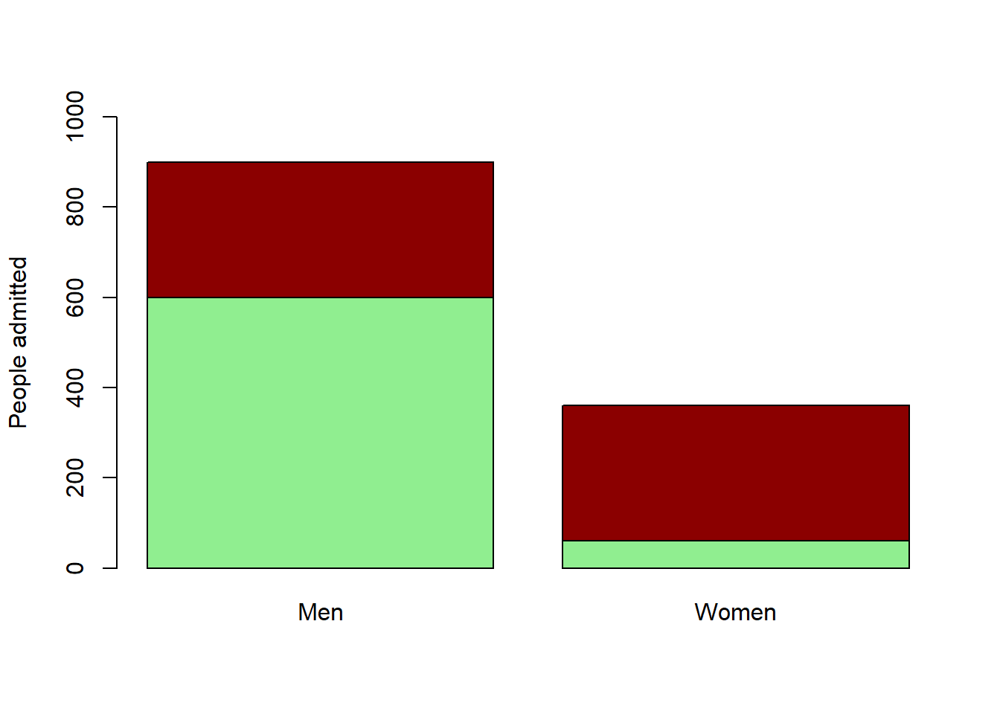
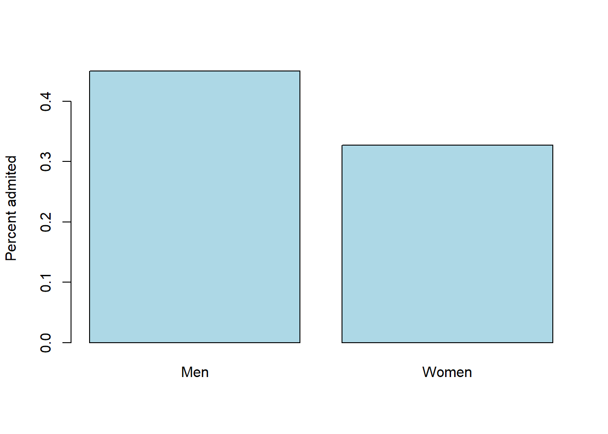

# Set A question 13 
(Page 24)

## Question

"A hypothetical university has two departments, A and B. There are 2,000 male applicants, of whom half apply to each department. There are 1,100 female applicants: 100 apply to department A and 1,000 to department B. Department A admits 60% of the men who apply and 60% of the women. Department B admits 30% of the men who apply and 30% of the women.' For each department, the percentage of men admitted equals the percentage of women admitted; this must be so for both departments together.' True or false, and explain briefly"

## Answer

**FALSE**

Let's check how many men and women were admitted:

We can see that more men were admitted than women, but let's compare the admission percent (divide by number of men or women):

Although each department accepted the same percent, with no regard to men/women applicants, higher percentage of men were admitted due to the higher applications for department A (50% of men) comparing to the women's. Department A's admission chances were higher (60%) than department B's, so a higher percentage of men were admitted. 
