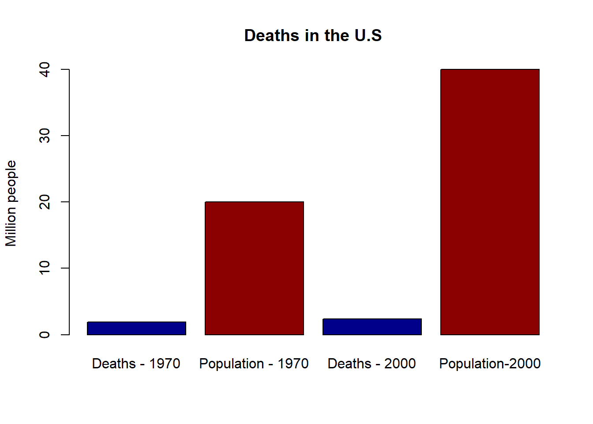
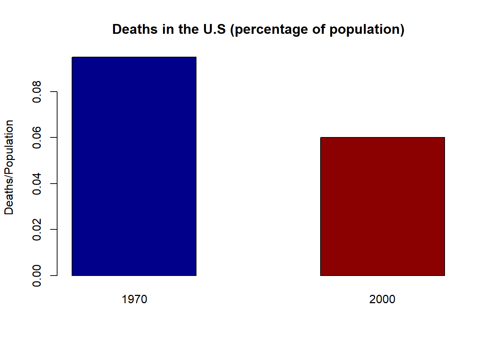

# Set A question 1 
(Page 20)

## Question

"In the U.S In 2000, there were 2.4 million deaths from all causes, compared to 1.9 million in 1970 - a 25% increase. 
True or false, and explain: the data show that the public's health got worse over the period 1970-2000."

## Answer

**FALSE**

Explain: Although the data points towards an overall increase in deaths,
it fails to show weather the public's health got worse over that time period. 

An absolute growth (from 1.9 million to 2.4 million) does not suggest **a relative growth**.
It is safe to assume that the population got bigger as well, which can explain the increase in
absolute number of deaths.

Let's look at an example of relative and absolute numbers (the population number is just for example):

As we can see, although the absolute number of deaths shows an increase of 25%, the relative deaths per population shows a decrease, which contradicts the conclusion that the public's health has got worse.

Let's look at the relative numbers:

